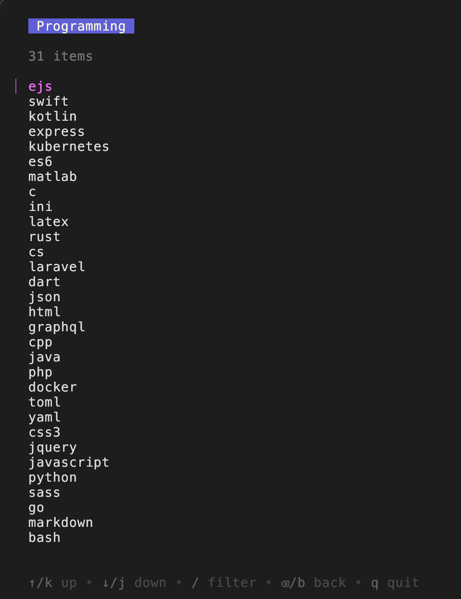
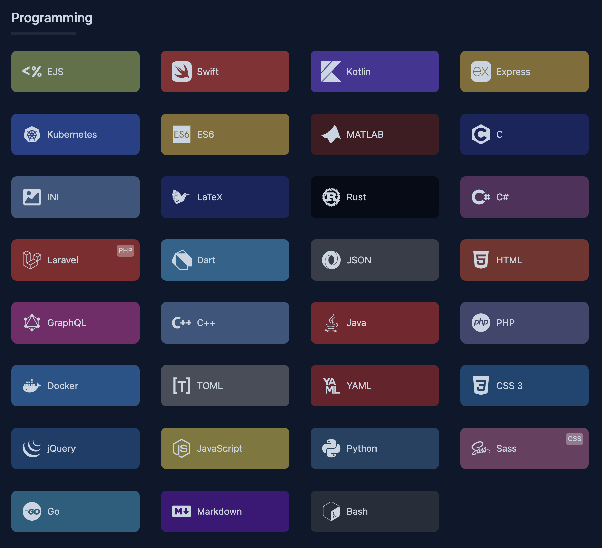
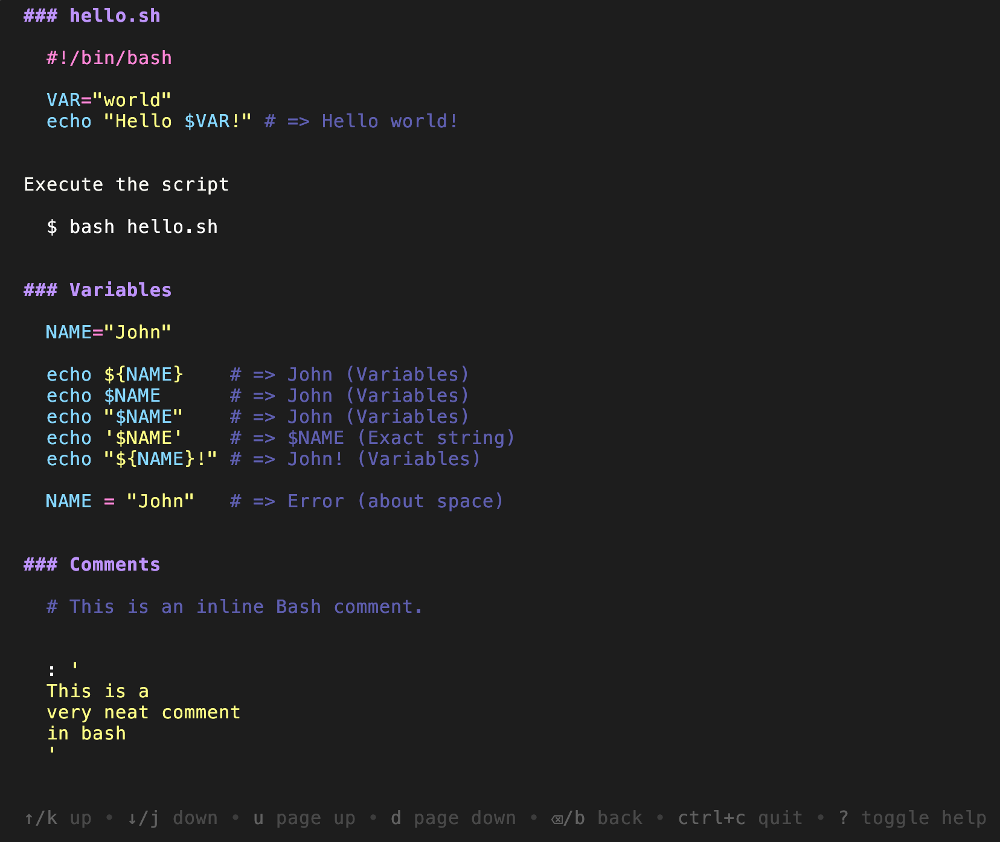
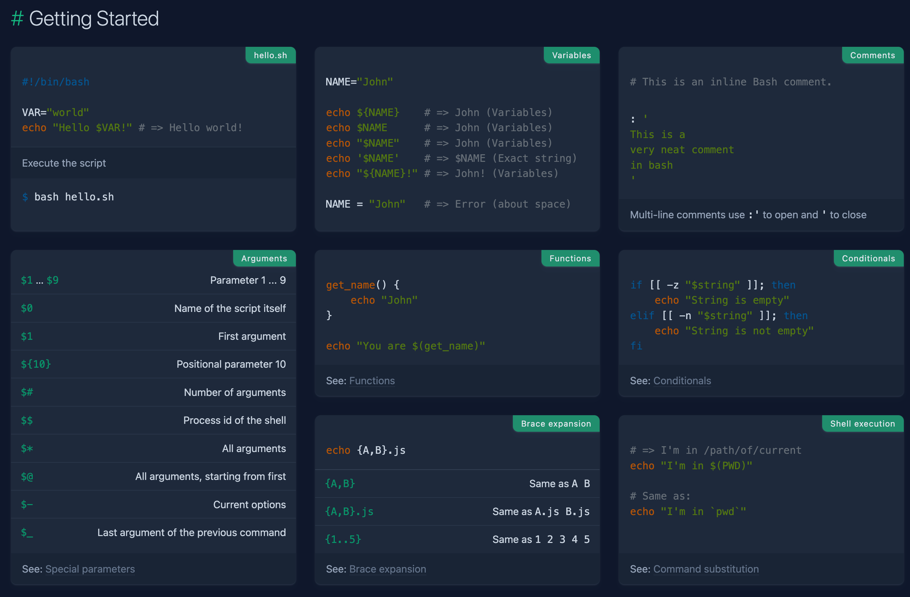

# ref

A web scrapper of [quickref.me](https://quickref.me) built in Go.


| ref | quickref.me |
| --- | ----------- |
|  |  |
|  |  |


> [!NOTE]
> This project is not fully finished, but should be 90% usable.


# How to try

## Prerequisites

- Go installed (>= v1.24.0)
- Just installed (optional) [more about just](https://github.com/casey/just)

## Installation and execution

1. Clone this repository.

```sh
git clone https://github.com/vieitesss/ref ~/ref
```

2. Access it.

```sh
cd ~/ref
```

3. Build it

```sh
go build . # or `just build`
```

3. Run it

```sh
./ref
```
