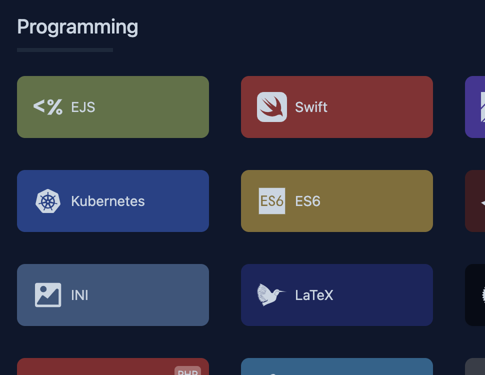
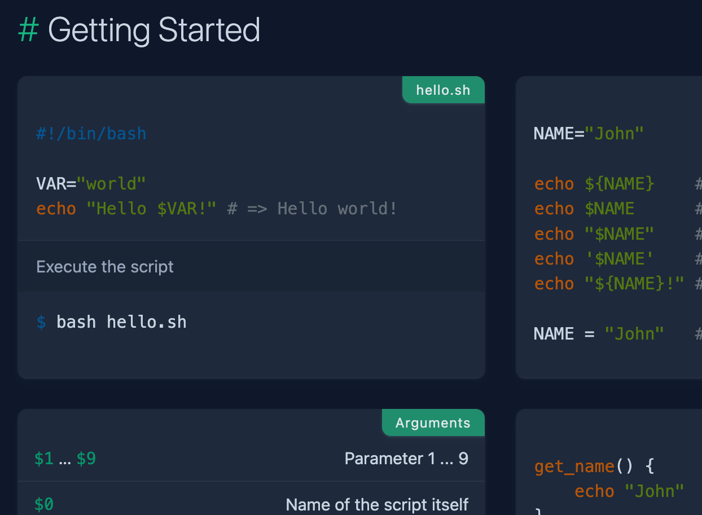

# ref

A web scrapper of [quickref.me](https://quickref.me) built in Go.


| ref | quickref.me |
| --- | ----------- |
|  |  |
|  |  |


> [!NOTE]
> This project is not finished yet.


# How to try

## Prerequisites

- Go installed (v1.24.1)

## Installation and execution

1. Clone this repository.

```sh
git clone https://github.com/vieitesss/ref ~/ref
```

2. Access it.

```sh
cd ~/ref
```

3. Run it

```sh
go run .
```
